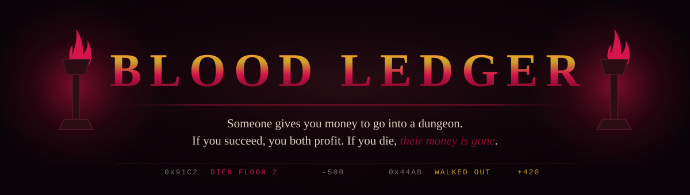
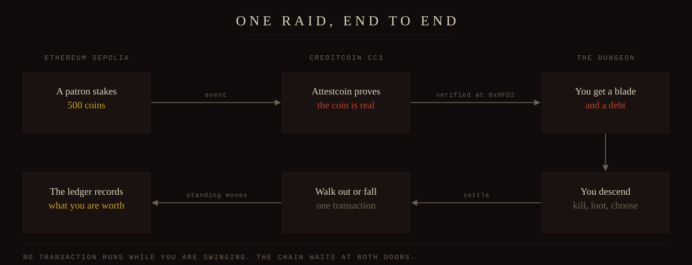

<p align="center">
  
</p>

<p align="center">
  <strong>An isometric dungeon crawler where somebody else paid for your sword.</strong>
</p>

---

## The short version

You are broke. The dungeon will kill you.

A patron puts up the coin for your descent. They pay on Ethereum. Creditcoin proves that
payment actually happened, then hands you a blade and a debt. You go down, you kill what
moves, and you decide when to turn back.

Walk out alive and you split the haul. Fall on the stair and their coin dies with you, and
the ledger writes your name next to the loss. Everyone can read it. Nobody funds a raider
who does not come back.

---

## One raid, end to end

<p align="center">
  
</p>

The chain waits at both doors and nowhere in between. No transaction runs while you are
swinging a sword.

---

## Where Attestcoin does the work

Blood Ledger uses the Attestcoin Protocol four times, for four different reasons. Take it
out and the game stops working.

| | What it proves | Why nothing else does it |
| --- | --- | --- |
| Funding | A patron really staked coin on Ethereum | The gear cannot be minted on a promise |
| Fair ground | The dungeon seed came from a real Ethereum block | Nobody picked the number, and anyone can check |
| Standing | A newcomer's past on Ethereum is genuine | You bring your reputation instead of grinding from nothing |
| Settling | Ten raids close under one continuity proof | Ten separate proofs would cost ten times as much |

Every proof is checked on Creditcoin by the block prover precompile at
`0x0000000000000000000000000000000000000FD2`, inside a single block.

One honest note. Attestcoin readability is live and writability is not, so payment flows
from Ethereum to Creditcoin and settlement happens on Creditcoin. Nothing is written back
to Ethereum, because that road does not exist yet.

---

## The realms

| | Creditcoin CC3 Testnet | Ethereum Sepolia |
| --- | --- | --- |
| Chain number | `102031` | `11155111` |
| Node | `https://rpc.cc3-testnet.creditcoin.network` | `https://rpc.sepolia.org` |
| Explorer | `creditcoin-testnet.blockscout.com` | `sepolia.etherscan.io` |
| Coin | tCTC | ETH |
| Its job | Where the game lives and settles | Where patrons put up their coin |

Testnet coin comes from the Creditcoin Discord, in the `token-faucet` channel:
`/faucet address:0xYourAddress`. There is no web faucet.

---

## Running it

You need Node 20 or newer, and a copy of the art pack.

**1. Get the art.** Blood Ledger draws with *Lords Of Pain - Old School Isometric Assets*
by Trevor Pupkin. The pack may not be redistributed, so it is not in this repository.
Buy it from [trevor-pupkin.itch.io/lords-of-pain](https://trevor-pupkin.itch.io/lords-of-pain)
and unzip it next to this folder.

**2. Gather what the game needs.**

```
npm install
npm run gather-art
```

That copies sixty five pieces of art out of the pack and into `public/art`, which is ignored by
git. If you unzipped the pack somewhere else, point at it:

```
LORDS_OF_PAIN_PACK="/path/to/the/pack" npm run gather-art
```

**3. Open the door.**

```
npm start
```

**Trimming, for the dungeon.** Every sprite in the pack sits on a 256 by 256 frame and
most of that frame is empty, so the dungeon ships a trimmed copy instead:

```
npm run trim-art
```

That reads `public/art`, crops each animation to the union of its solid pixels across all
frames, and writes the result plus the original offsets to `public/art/trimmed`. Around 86
percent of the bytes go, and the offsets are kept so sprites still line up with each other
in the world. Ground textures and the vignette are copied whole on purpose. Pages one and
two read the untrimmed originals and are not affected by this step.

---

## How the code is named

The code speaks the same language as the game. There are no abbreviations and no cryptic
names, and nothing is called a manager or a handler.

| In the code | What it means |
| --- | --- |
| `purse` | The player's wallet |
| `realm` | A chain |
| `homeRealm` | Creditcoin, where the game lives |
| `door` | The button that opens the purse |
| `scroll` | A panel that unrolls in place |
| `torch` | A burning brazier |
| `flipbook` | A sprite animation, one frame at a time |
| `watcher` | The Demonlord, waiting in the dark |
| `standing` | What a raider is worth, F through A |
| `plinth` | Where your raider stands and turns |
| `offer` | A patron's terms, before you take them |
| `pact` | An offer you accepted, and the debt it carries |
| `rite` | The four steps that seal a pact across the chains |
| `tally` | The bar across the top: purse, coins, standing |

---

## What stands so far

| | |
| --- | --- |
| Page one, the landing | Built |
| Page two, the hall of patrons | Built, reading worked examples |
| Page three, the dungeon | Next |
| The contract on Ethereum | Not started |
| The contract on Creditcoin | Not started |
| The worker that carries proofs | Not started |

The hall reads its patrons, standing and ledger from stand-in data while the contracts are
still to come, and says so on the page itself. The four step sealing rite runs on a
rehearsal clock rather than real block times. Swapping `src/chain/theLedger.ts` for real
reads is the only change the pages need.

---

## Built with

Phaser for the dungeon, TypeScript and Vite for everything else, ethers for talking to
purses, Foundry for the contracts, and `@gluwa/usc-sdk` for the proofs.

Type is set in Nosifer for the wordmark, Cinzel for anything you click, Crimson Pro for
reading and JetBrains Mono for numbers. The art pack ships no font, so all four come from
Google Fonts.

---

## Licence and credit

The code here is ours. The art is not. *Lords Of Pain - Old School Isometric Assets* is
licensed for use in free and commercial work but may not be redistributed, even modified,
so you must bring your own copy. No attribution is required by that licence, but it is
given here anyway, because the art is most of what you see.
