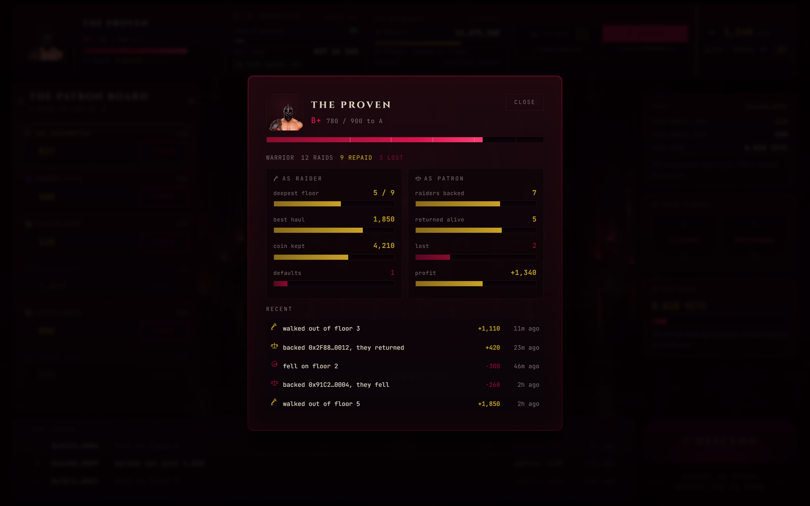

<p align="center">
  
</p>

<p align="center">
  <strong>An isometric dungeon crawler where somebody else paid for your sword.</strong>
</p>

---

## The short version

You are broke. The dungeon will kill you.

A patron puts up the coin for your descent. They pay on Ethereum. Creditcoin proves that
payment actually happened, then hands you a blade and a debt. You go down, you kill what
moves, and you decide when to turn back.

Walk out alive and you split the haul. Fall on the stair and their coin dies with you, and
the ledger writes your name next to the loss. Everyone can read it. Nobody funds a raider
who does not come back.

---

## The six pages

### One. The landing

<p align="center">
  
</p>

A hooded skull and a wordmark of running fire, both real models turning slowly in the
dark. They lean toward your pointer. Below them the pitch, and a door: press it and the
game asks for your purse, and moves it to Creditcoin if it is sitting somewhere else.

Two scrolls unroll in place, one for raiders and one for people who would rather put up
the coin than carry the sword. Nothing here needs a wallet to read. Bottom right are the
two switches for the fighting and the music, remembered on your machine.

---

### Two. The hall of patrons

<p align="center">
  
</p>

Where you take on debt. Six bays across the top: your face and standing, what the
underwriter thinks of you, what the witnesses have agreed, which side you are playing, and
your purse.

**That header is live.** Your standing, your grade and your bond are read from the ledger
deployed on Creditcoin — not from anything this page invented. The witnesses have reached
Sepolia block 11,660,240 and sit 38 blocks behind, so a payment made right now proves in
about eight minutes.

**So is the board.** It is not a list we wrote. The page walks the vault on Ethereum for
every stake ever made, asks Creditcoin what became of each one, and shows you the ones
pointed at your address. There is no such thing as an unclaimed offer in this protocol: a
patron names the raider in the same breath as they pay. So the board does not say *here are
some strangers with money.* It says **someone put up coin in your name** — and if nobody
has, it says that too, and points you at the House.

Your raider stands in the hall itself and turns while you pick between Warrior, Knight and
Fighter — three real models, lit by the braziers behind them.

The rail on the right reads before you commit as well as after. With no pact it shows what
the kindest offer open to you would lend, what they would keep, and the bond you would have
to lock up. Below it the two powers that class brings.

Along the bottom runs **what is happening below** — every stake anyone has made, most
recent first, with where it stands: *waiting on the witnesses*, *open*, *over*, or *taken
back*. Four states, each one worked out from the two contracts. Nothing on that strip was
typed by us.

---

### Three. The patron's table

<p align="center">
  
</p>

The same game from the other side. Switch to Patron in the header and your purse moves to
Sepolia, because that is where the money is.

On the left you write a stake: whose address is going down, how much, and what share you
keep of whatever they carry out.

**Type an address and the ledger answers.** Stop typing, and a moment later a card appears
under the field holding what Creditcoin actually knows about that person — their title,
their score, how many raids, how many repaid, how many lost. Four things it will tell you
that no amount of staring at an address would:

> **Nobody by that name.** Has never been down. No record, no standing. You would be the
> first to trust them.

> **Already holds a pact from 0x505B…f3ab.** They must settle it before another.

> **You have backed this raider 1 time.** Another earns them 3 standing instead of 28.

> **That is you.** You cannot put up coin for yourself.

That third one is the anti-farming rule showing its face before you spend rather than
after. The ledger halves what a raider earns each time the same patron backs them again,
and stops paying out entirely after five. The page reads that number off the chain and
tells you what your next stake would actually be worth to them.

**Then it asks before the money moves.** Pressing *Put Up The Coin* opens a slab first: who
they are, what you lend, what you keep, and the line that matters — *if they fall, your
coin is gone. All of it.* It keeps reading the ledger while it sits there, so the title and
the repeat warning fill in live. Escape or *Keep it* backs out. Nothing reaches your wallet
until you press the second button.

On the right, every raider who wants coin, with their record laid out plainly and the
awkward parts said out loud:

> has lost three patrons and repaid one
>
> every pact came from one purse, and the coin went in a circle

That second one is the game refusing to let two wallets pass the same coin back and forth to
manufacture a reputation. The vault counts how many times each patron has funded each
raider, and the ledger reads that count when it works out what the standing was worth.

You cannot fund yourself, and the table says so if you try.

---

### Four. The dungeon

<p align="center">
  
</p>

Where the debt gets paid or does not. Isometric, drawn straight onto a canvas, no game
server — the fight is entirely on your machine and no transaction runs while you are
swinging.

**Top right names the Ethereum block this floor was carved from.** Nobody chose it, and it
links out so you can check.

Across the top: the floor, what you have killed, and what you owe. Bottom left, your life.
Bottom middle, your two powers and how long until they come back. Bottom right, the only sum
that matters — what you carry, what the patron takes, what you keep, and how far short of
the debt you still are. Extract sits under it, live from the first second.

Clear the floor and the stair opens and stays open. But the dark keeps sending, so every
extra moment spent looting is a moment spent being hunted.

---

### Five. Your record

<p align="center">
  
</p>

Click your face in the header. Everything the ledger knows about you, in one slab.

Left, what you have done as a raider — how deep you went, the best haul you carried out,
the coin you kept, how many patrons you cost. Right, the same from the other side: how many
raiders you backed, how many came home, what you made. Below, your last deeds with the
figures and how long ago.

It moves. Walk out of a raid and the numbers here change with it — standing, coin, deepest
floor, and a new line at the top of the list.

---

### Six. The reckoning

<p align="center">
  
</p>

The split, in the order that matters: what you carried out, what the patron takes, what you
keep, whether the debt cleared, and where your standing landed.

Then what you left behind — the gems, the coin never picked up, the barrels never broken,
the powers never used, and whether you ever met the Demonlord. Walking out early is always
allowed. This is the page that tells you what it cost.

---

## How it is put together

<p align="center">
  
</p>

Four places, and nothing hidden in a server you cannot see.

**Your browser** draws every screen and runs the whole dungeon. There is no game server.
The fight happens on your machine, and no transaction runs while you are swinging a sword.

**Ethereum** holds the patron's stake. That is the only thing it does.

**Creditcoin** holds everything that outlives a raid: the pact, your standing, the
settlement.

**The worker** is the only thing on the stair between them, and it cannot cheat, because it
carries a proof rather than a message.

**The house** is a convenience, not part of the rules. Turn it off and the game still
works; you just have to go and find a faucet.

---

## How we used Attestcoin

### What Attestcoin is, in one paragraph

A group of witnesses watch Ethereum and write down what they saw, on Creditcoin. Once
enough of them agree about a block, any program running on Creditcoin can ask two questions
and trust the answer without trusting us:

**How far have you got?** — the last Ethereum block the witnesses agree on.

**Did this exact payment really happen?** — proof of one transaction inside one block.

Blood Ledger asks the first question in the browser and the second in the contract. Take
either one away and the game stops working.

### The first question, asked in the browser, live right now

Open the game and look at the top right of any screen. Those numbers are not decoration.
The game asks Creditcoin, several times a minute, which chains the witnesses are watching
and how far they have got on each.

The same answer decides your dungeon. Before you descend, the game takes the last Ethereum
block the witnesses agreed on and builds the floor from it — the rooms, the corridors,
where the enemies stand, where the loot fell.

**Nobody chose that number.** Not us, not you. The bar at the top of the dungeon names the
block it came from, so a player who does not trust us can go and look it up on either
explorer. If Creditcoin cannot be reached, the game rolls locally and says so in blood red
rather than pretending.

A dungeon crawler whose own author cannot reseed the map is a small thing to build and a
very strange thing to fake.

| | Where |
| --- | --- |
| Which chains are watched | `src/chain/witnesses.ts:52` |
| How far the witnesses have got | `src/chain/witnesses.ts:57` |
| The floor you play | `src/chain/attestedSeed.ts:16` |

This part needs no contracts of our own. It works against the live testnet today.

### The second question, asked by the contract

When a patron pays on Ethereum, the vault shouts one thing: *this person staked this much
on that raider.* Nothing else.

The worker sees it, waits for the witnesses, fetches the proof, and hands it to the ledger
on Creditcoin. The ledger reads the payment **out of the proof itself** — it never takes the
worker's word for anything. A proof already used is refused. A proof from a vault it was
not told to trust is refused.

That last guard matters more than it sounds. Until someone names the one vault the ledger
should believe, every proof is refused. Without it, anybody could point at some other
contract that happens to shout a similar thing, prove it, and get a free pact.

| | Where |
| --- | --- |
| The proof checker | `contracts/sol/TheLedger.sol:16` |
| Reading the payment out of the proof | `contracts/sol/TheLedger.sol:267` |
| The one vault it will believe | `contracts/sol/TheLedger.sol:126` |

### The third question, asked back in the browser

Once the ledger has sealed a pact, everything it learned is public and the game reads it
back. No indexer, no database, no server of ours in between — the browser asks the two
contracts directly and joins the answers.

| What the page asks | Which chain | Where |
| --- | --- | --- |
| What is this raider's standing | Creditcoin | `src/chain/askTheLedger.ts:70` |
| What bond must they lock up | Creditcoin | `src/chain/askTheLedger.ts:97` |
| Do they already hold a pact | Creditcoin | `src/chain/askTheLedger.ts:120` |
| What became of these pacts | Creditcoin | `src/chain/askTheLedger.ts:155` |
| How often has this pair dealt | Creditcoin | `src/chain/askTheLedger.ts:186` |
| Every stake ever made | Ethereum | `src/chain/coinPutUp.ts:60` |
| The two joined into one board | both | `src/chain/whatIsOnTheBoard.ts:13` |

The board is the clearest case. One read goes to Sepolia for the money, one goes to
Creditcoin for what happened to it, and the row you see is the two answers put together.
A stake that has left Ethereum but not yet cleared the witnesses shows as **waiting on the
witnesses** — which is Attestcoin's nine minute agreement window, rendered as a line of
text in a game.

Every number on that page can be checked on either explorer. We would rather you did.

### One thing we will say plainly

Attestcoin can prove things **to** Creditcoin today, but not back the other way. So coin
flows from Ethereum to Creditcoin and settlement happens on Creditcoin. Nothing is written
back to Ethereum, because that road does not exist yet. We built for the road that is
there.

---

## One raid, end to end

<p align="center">
  
</p>

The chain waits at both doors and nowhere in between.

---

## How the game works

### The three you can be

| | Life | Hurts | Reach | Pace | Powers |
| --- | --- | --- | --- | --- | --- |
| Warrior | 100 | 26 | 78 | 168 | Cleave, Bulwark |
| Knight | 140 | 30 | 84 | 128 | Slam, Guard |
| Fighter | 80 | 20 | 72 | 210 | Flurry, Dash |

Nothing levels up inside a raid. You are as strong on floor nine as on floor one, and every
floor you descend heals you to full. Depth is not attrition; depth is arithmetic.

### The floor

Each floor takes one of five shapes, carved into chambers and joined by corridors from the
seed. `5 + floor × 2` enemies stand where the seed put them. Nine breeds come out of three
sprites, tinted and scaled and given their own life, reach and pace. Barrels break open,
gems are graded by colour so you can read what one is worth from across a room, and
braziers light the corners.

### The dark keeps sending

Clearing a floor used to make it safe forever, which meant looting cost nothing and the
decision the game is named for had no teeth. Now the dungeon keeps sending things at you
for as long as you stay.

```
gap between arrivals = 15.0s
    − 1.1s × (floor − 1)                 how deep you are
    − 2.4s × (minutes on this floor)     how long you have lingered
    − 3.6s × (coins carried ÷ owed)      how much of their money you hold
    never faster than 4.2s, never more than 16 awake at once
```

Worked example — floor 5, two minutes in, carrying one and a half times your stake:
`15.0 − 4.4 − 4.8 − 5.4` clamps to **4.2 seconds**. Something every four seconds. You are
not looting that floor any more, you are running for the stair.

That third line is the part we care about. **Difficulty is a function of the loan.** The
more of the patron's money you are holding, the harder the dungeon fights to keep it.

Every arrival comes from an unlit tile at least 560 pixels away and off the edge of your
screen, so the only warning is a sound. Stay long enough and it stops sending rank and file
and starts sending elites.

### The Demonlord

He waits on floor six, once. Not before, and not again.

| | Hits to kill him | His hits to kill you |
| --- | --- | --- |
| Warrior | 13 | 5 |
| Knight | 11 | 7 |
| Fighter | 16 | 4 |

He has 320 life and a reach of 104, which outranges every class. Standing and trading blows
always loses. His pace is 92 against your 128 to 210, so kiting is the whole fight.

### Walking out, or going down

The stair opens once you have cleared the floor and stays open after, even as more arrive.
Then it is your call: settle now, or take the stair.

Walk out and the patron takes their share of what you carried. Fall and they lose the
stake. Standing moves by **+28** for clearing your debt, **−12** for walking out short, and
**−86** for dying.

---

## The underwriter, and what the model is allowed to do

There is a language model in here, and it decides nothing. It is the voice, never the
judgement.

**The Underwriter** is a lender who reads a raider and says yes or no. Two separate things
happen when it does.

**First, arithmetic decides.** `judge()` in `src/chain/underwriting.ts` is plain rules with
no model anywhere near them. It counts eight things that should worry a lender — never been
down, never repaid anyone, lost more than repaid, standing under the floor, only ever
funded by one purse, funded by a wallet made the same day, money that went in a circle, a
pair that has already dealt five times.

Four of those refuse outright. The rest feed a sum that weighs the repayment record at half
and standing at three tenths, subtracts a little for a raider who goes deep or spreads
their patrons, and adds seven points for every flag raised. Out of that comes one number
between 0.02 and 0.98: the risk of default. Above 0.62 the answer is no. Below it, the
share the patron keeps is priced straight off the risk — twenty percent plus seventy times
it — and what the Underwriter will lend is the ceiling times the trust left over.

Run the same raider through it twice and you get the same answer twice. It is a
calculation, not an opinion.

**Then the model writes it up.** `putItInWords()` in `underwriter/explain.ts` is handed a
decision that has already been made and asked for two sentences: one spoken to the raider,
one line for the board. That is the model's entire job.

What it is given, and nothing more:

| It sees | It never sees |
| --- | --- |
| A fantasy handle — *Ashfoot*, *Bonewright* | The wallet address |
| Standing, grade, raids, repaid, lost | Any balance |
| The verdict and terms, already fixed | Any key, or the `.env` |
| The reasons the rules gave | Any other player's data |

`handleFor()` swaps `0x7a3f…` for a name before anything leaves the machine. The system
prompt tells it plainly that it is not being consulted, must never argue with the decision
or suggest different terms, must invent no numbers, and must never invite anyone to follow
a link or send anything anywhere. The answer comes back through a strict JSON schema with
hard length caps.

**Then we check its work.** An answer is thrown away if it is empty, too long, stops
mid-sentence, or contains a link, an at-sign, or anything shaped like an address.
`scrubbed()` makes a final pass and replaces any address or hash that survived. If the
model is thrown away — or there is no API key, or the call takes longer than twelve
seconds, or the endpoint errors — `ourOwnWords()` writes the sentence instead and the game
carries on. Every path ends in a sentence, and a `camefrom` field records which one wrote
it.

The worst thing a compromised model can do here is get its prose thrown away.

| | |
| --- | --- |
| `src/chain/underwriting.ts` | `judge()` — the decision. Plain rules. No model. |
| `underwriter/masking.ts` | `handleFor()` — `0x7a3f…` becomes *Ashfoot* before anything leaves |
| `underwriter/schema.ts` | `howToBehave` — what it may and may not do |
| `underwriter/explain.ts` | `putItInWords()` — the model writes the reason, and nothing else |
| `underwriter/explain.ts` | `willNotUse()` — what comes back is checked before it is shown |
| `underwriter/masking.ts` | `scrubbed()` — a last pass on the way out |

`tests/underwriter.test.mjs` covers what it refuses to print.

```
npm run underwriter
```

---

## What is real and what is not

We would rather say this ourselves than have it found.

| | |
| --- | --- |
| Attestcoin reads, in the browser | **Live.** Real heights, real hashes, every refresh |
| Floors seeded from an attested block | **Live** |
| The dungeon, start to finish | **Playable** |
| The landing hero and the three champions | **Live**, real models |
| `PatronVault` on Sepolia | **Deployed.** `0xcBB956Fa0358F53B9A83b78d6586a1fbB46fF64e` |
| `TheLedger` on Creditcoin | **Deployed**, holding two real sealed pacts |
| Standing, grade and bond in the header | **Read from Creditcoin** |
| The board, and coin put up in your name | **Read from both chains and joined** |
| What is happening below | **Read from both chains and joined** |
| Reading a raider before you back them | **Read from Creditcoin**, live as you type |
| The house purse and house patron | **Running**, staking real coin on Sepolia |
| The four step sealing rite | **A stand-in clock.** Real sealing takes about nine minutes |
| Raiders seeking coin, on the patron page | **Stand-in.** A raider never registers interest on chain |

Two things on that list are still stand-ins, and both for the same honest reason.

**The sealing rite** shows four steps in about seven seconds. Really sealing a pact means
waiting for the witnesses to agree, which takes about nine minutes. The steps it shows are
the real steps in the real order; only the clock is wrong. For a demo, seal one beforehand
and show the finished pact.

**Raiders seeking coin** is the one list with no chain equivalent at all. A raider cannot
announce that they want funding, because nothing in either contract lets them. The patron
names the raider; the raider is never asked. We left the list rather than pretend it
resolves to something on chain.

Everything above those two lines can be checked on an explorer.

---

## Built with

| | |
| --- | --- |
| Front end | TypeScript and Vite, no framework. Plain DOM parts |
| The dungeon | Canvas 2D, a trimmed sprite atlas, `sort by y` |
| The landing and the plinth | three.js. Five models, Draco compressed |
| Sound | Web Audio. 27 effects, synthesised, no files. One streamed track |
| Talking to purses | ethers v6 |
| Reading Attestcoin | `@gluwa/usc-sdk` |
| Contracts | Solidity 0.8.30, Foundry, `@gluwa/asc-contracts` |
| The worker | Node and tsx, polling Sepolia every twelve seconds |
| The house | Node's own `http`, no framework |
| The underwriter | Azure OpenAI, narration only, behind a scrubber |

The dungeon draws straight onto a canvas rather than through a game engine, because the
whole of its rendering is one line, `sort by y`, and a framework would have cost more than
it returned.

Type is set in Nosifer for the wordmark, Cinzel for anything you click, Crimson Pro for
reading and JetBrains Mono for numbers, all four from Google Fonts.

---

## Running it

### Five minutes, no coin needed

```
npm install
npm run dev
```

Press the door. Watch the witness bay count real Attestcoin heights, and the board read
both chains for coin put up in your name.

A fresh wallet has nobody backing it, so the board will say so. Open the house and it will
both fill an empty purse and put up real coin for you, from inside the game, so nobody has
to leave for a faucet:

```
npm run house
```

### The whole thing

You need Node 20 or newer.

**1. Gather the art.**

```
npm install
npm run gather-art
```

That collects sixty five pieces of art into `public/art`, which is ignored by git so the
images never land in the repository.

**2. Open the door.**

```
npm start
```

**How to play.** W A S D to move, click or space to swing, Q and E for your two powers.
Walk over coin and gems to take them, swing at barrels to break them open, and press
Extract before something kills you.

**Trimming, for the dungeon.** Every sprite arrives on a 256 by 256 frame and most of that
frame is empty, so the dungeon ships a trimmed copy instead:

```
npm run trim-art
```

That reads `public/art`, crops each animation to the union of its solid pixels across all
frames, and writes the result plus the original offsets to `public/art/trimmed`. Around 86
percent of the bytes go, and the offsets are kept so sprites still line up with each other
in the world. Ground textures and the vignette are copied whole on purpose. Pages one and
two read the untrimmed originals and are not affected by this step.

---

## The realms

| | Creditcoin CC3 Testnet | Ethereum Sepolia |
| --- | --- | --- |
| Chain number | `102031` | `11155111` |
| Node | `https://rpc.cc3-testnet.creditcoin.network` | `https://ethereum-sepolia-rpc.publicnode.com` |
| Explorer | `creditcoin-testnet.blockscout.com` | `sepolia.etherscan.io` |
| Coin | tCTC | ETH |
| Its job | Where the game lives and settles | Where patrons put up their coin |

Testnet coin comes from the Creditcoin Discord, in the `token-faucet` channel:
`/faucet address:0xYourAddress`. There is no web faucet.

---

## Checking it

```
npm run check-setup      # reaches both chains, spends no gas, says what is still missing
npm test                 # settlement, agreement, attacks, the underwriter, the dark
npm run test-contracts   # 16 Foundry tests over PatronVault
npm run test-testnet     # reaches the live Attestcoin testnet
```

The settlement tests read the constants straight out of `TheLedger.sol`, so the contract
cannot drift away from them quietly. The agreement test holds `src/chain/settling.ts`
against the same constants, because a game that shows one number while the chain records
another is worse than a game that shows nothing.

Run `check-setup` first. It reads your `.env`, reaches both chains, reports the balance in
each purse, and asks Attestcoin whether Sepolia is attested. It will tell you exactly which
deployment steps are still outstanding and why.

---

## The contracts

Two contracts, one on each chain, and a worker between them. Both are deployed, and the
game reads them live.

| | Chain | Address |
| --- | --- | --- |
| `PatronVault` | Ethereum Sepolia | [`0xcBB956Fa0358F53B9A83b78d6586a1fbB46fF64e`](https://sepolia.etherscan.io/address/0xcBB956Fa0358F53B9A83b78d6586a1fbB46fF64e) |
| `TheLedger` | Creditcoin CC3 | [`0xe8608320bBEA393464f235ecBBBa8f820D7ecE10`](https://creditcoin-testnet.blockscout.com/address/0xe8608320bBEA393464f235ecBBBa8f820D7ecE10) |

Pact 1 on that ledger was sealed from a real Sepolia payment, proved through Attestcoin.
You can read it without our help: call `pacts(1)` on the ledger, or `stakes(1)` on the
vault, and the two will agree.

**`PatronVault.sol`** sits on Ethereum and does one thing: hold a stake and shout
`RaidFunded(raider, patron, pactId, coinsStaked, patronShare)`. It knows nothing about
Creditcoin. The smallest stake worth anything is 0.001 ETH, a patron may keep at most 80
percent, and an unclaimed stake can be taken back after seven days.

**`TheLedger.sol`** sits on Creditcoin and extends `ASCBase` from `@gluwa/asc-contracts`.
That base calls the block prover precompile at
`0x0000000000000000000000000000000000000FD2`, refuses any query id it has already seen, and
only then hands control to our `_processAndEmitEvent`. So every number the ledger acts on
came out of a proved Ethereum transaction, and no proof can be spent twice.

The ledger will only believe one vault. `nameTheVault` is set once, and a funding log from
any other address is refused, so a proved transaction from some other contract cannot seal
a pact here.

It also holds the bond, which falls as you earn it:

| Standing | Bond |
| --- | --- |
| below 300 | 100 percent of 0.1 tCTC |
| 300 and up | 80 percent |
| 450 and up | 60 percent |
| 600 and up | 30 percent |
| 750 and up | 10 percent |
| 900 and up | nothing at all |

Reputation is the only thing in this game worth real money.

**The worker** watches the vault, waits for the block to be attested, asks the proof builder
for a Merkle and continuity proof, and calls `execute` on the ledger.

```
npm run build-contracts
npm run check-setup       # reads your .env, spends no gas
npm run deploy-vault      # on Sepolia
npm run deploy-ledger     # on Creditcoin
npm run name-vault        # tell the ledger which vault to believe
npm run worker            # carry proofs
npm run house             # fill empty wallets from inside the game
```

**[DEPLOYING.md](DEPLOYING.md) walks the whole way**, from an empty `.env` to a sealed
pact, including where to get testnet coin and what the errors mean.

Contracts compile with `viaIR` and evm version `shanghai`, matching Gluwa's own settings,
because `ASCBase` hits stack-too-deep without it.

One thing to plan a demo around: **the attestation wait is around eight minutes, sometimes
twenty.** That is the witnesses reaching agreement about the Sepolia block your funding
landed in, and it is not something the worker can hurry. It is also the thing that makes the
proof worth having.

---

## Licence

The code is **MIT**. Read it, run it, fork it, ship it — see [LICENSE](LICENSE).

That covers the source and nothing else. The artwork, the 3D models and the music are
licensed separately, are not covered by the MIT grant, and are kept out of this repository
by `.gitignore` rather than committed. `npm run gather-art` collects them from your own
copy. The four typefaces come from Google Fonts under the SIL Open Font License.
